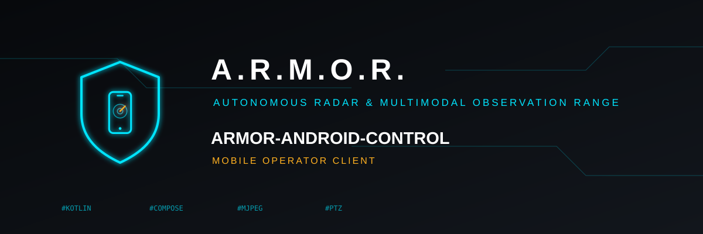

<p align="center">
  
</p>

# 📱 ARMOR-ANDROID-CONTROL

<p align="center">
  <a href="README.md">🇺🇸 English</a> |
  🇪🇸 <b>Español</b> |
  <a href="README_fra.md">🇫🇷 Français</a> |
  <a href="README_ita.md">🇮🇹 Italiano</a> |
  <a href="README_deu.md">🇩🇪 Deutsch</a> |
  <a href="README_zho.md">🇨🇳 简体中文</a> |
  <a href="README_jpn.md">🇯🇵 日本語</a>
</p>

### Cliente móvil de operador para ARMOR-SERVER

<p align="center">
  
  
  
  
</p>

---

**Comprobación de honestidad - qué funciona hoy:** Las reglas de seguridad de la dirección y de decisión de alarmas tienen tests unitarios y la app compila. **No se ha ejecutado en un teléfono contra el servidor**, así que el permiso de notificaciones y el servicio en segundo plano no están verificados; armar, alarmas y dispositivos siguen las rutas del servidor pero no se han probado en un teléfono real.

---

## 🎯 Descripción general

* **Acceso con el login del propio servidor:** IP, puerto, usuario y contraseña; la contraseña crea una sesión HttpOnly y nunca se guarda en el teléfono.
* **Monitor de cámaras:** de 1 a 16 mosaicos, vista ampliada, MJPEG en directo que respeta la proporción, mando PTZ acotado, capturas y grabaciones.
* **Armar y desarmar**, con confirmación; **alarmas** para confirmar, con un aviso de las pendientes; **dispositivos** (humo, gas, inundación, puerta, ventana, movimiento, clima, enchufes, luces, sirenas, cerraduras) con su estado y Encender / Apagar / Alternar.
* **Radar en directo, en 2D y 3D:** la pestaña Radar dibuja el emplazamiento diseñado en Studio (terreno, edificios, árboles, postes, los campos de los radares y de las cámaras) y las personas que ven los radares moviéndose sobre él, cada segundo y medio; arrastra, pellizca y gira la vista 3D. La colocación sigue las reglas de Studio, pero nunca ha mostrado un radar real.
* **Solar:** una entrada en *Más* (y un mosaico en Estado) muestra los totales (sol, consumo, baterías con su carga y flujo, si hay red) y cada inversor y batería que el servidor informa: sus números, las celdas de una batería a demanda con la más alta y la más baja marcadas, los equipos que aún esperan datos y una marca en una lectura de ejemplo o un equipo sin señal. Se actualiza cada cinco segundos mientras está abierta; probada con las formas de respuesta del servidor y en un emulador contra un servidor local con lecturas de ejemplo, nunca con equipos reales.
* **Configurar un nodo de campo por Bluetooth** (desde la pantalla de acceso o *Más > Configurar un nodo*): encuentra los nodos que anuncian `ARMOR-xxxxxx`, crea el administrador de uno nuevo o inicia sesión, busca redes Wi-Fi y fija el nombre del nodo, el Wi-Fi de un router o una dirección fija y el broker, para nodos sin cable Ethernet. Compilado y con tests unitarios, nunca ejecutado contra un nodo ni un teléfono.
* **Biblioteca de evidencias**, estado del perímetro y de los nodos, y un **historial** de cada cambio de alerta, nodo, cámara, dispositivo, alarma y modo.
* **Notificaciones de alarma** cuando un nodo llega a ALTA, una cámara deja de responder, un dispositivo da alarma (humo, gas, inundación o pánico siempre; puerta, ventana o movimiento con el sistema armado) o, con el sistema armado, un nodo se cae; una vigilancia opcional en segundo plano usa la sesión actual y avisa cuando termina.
* **Cuidado con la contraseña:** el HTTP plano solo se permite hacia un *literal* IPv4 de LAN privada o loopback. Se rechaza un nombre de host que solo empieza como una dirección privada (`10.atacante.ejemplo`) o una dirección con cero a la izquierda (algunos resolvedores leen `010.0.0.1` como la pública `8.0.0.1`).
* **Un aspecto hecho de iconos:** superficies casi negras, acento cian, ámbar para lo que requiere atención, iconos grandes con pocas palabras, barra inferior, una página Acerca de y un botón para cerrar sesión.

## 📂 Estructura del repositorio

```text
ARMOR-ANDROID-CONTROL/
├── app/src/main/java/es/electrohobby3d/armor/
│   ├── ArmorActivity.kt (el armazón), EntryScreens.kt (presentación, acceso, cuenta, Acerca de), HomeScreens.kt, CameraScreens.kt, MoreScreens.kt, SolarScreens.kt
│   ├── ArmorViewModel.kt, Friendly.kt, AlarmPolicy.kt, AlarmNotifier.kt, AlarmWatcherService.kt
│   ├── ArmorTheme.kt, ServerEndpoint.kt, MjpegFeed.kt
│   ├── network/   model/
└── app/src/test/   tests de seguridad de la dirección y de palabras sencillas
```

## 🛠️ Entorno de desarrollo

```powershell
.\gradlew.bat testDebugUnitTest assembleDebug
adb install -r app\build\outputs\apk\debug\app-debug.apk
```

El APK de depuración no está firmado para distribución. Véase el [límite del cliente](docs/CLIENT_BOUNDARY.md).

## 🔗 Proyectos relacionados

**A.R.M.O.R.** (Autonomous Radar & Multimodal Observation Range) es un sistema de seguridad perimetral hecho de repositorios independientes. Cada uno tiene su propia versión, sus propias pruebas y su propio README; esta es la familia:

* **[ARMOR-COMMON](../ARMOR-COMMON)** - Contratos de mensajes, validadores, vectores de conformidad y tipos generados
* **[ARMOR-RADAR](../ARMOR-RADAR)** - Firmware del nodo de campo para ESP32-S3 con tres radares y su propio panel web
* **[ARMOR-SOLAR](../ARMOR-SOLAR)** - Protocolos de inversores y baterías solares y los mensajes de un nodo pasarela
* **[ARMOR-SERVER](../ARMOR-SERVER)** - Coordinador central: telemetría, alarmas, dispositivos, lecturas solares y cámaras
* **[ARMOR-STUDIO](../ARMOR-STUDIO)** - Consola web: cámaras, radar, alarmas, energía solar y el diseñador de sitio 2D/3D
* **ARMOR-ANDROID-CONTROL** (este repositorio) - Cliente Android del operador con radar 2D/3D en vivo
* **[ARMOR-SERVER-AI](../ARMOR-SERVER-AI)** - Política de inferencia visual que explica sus decisiones y nunca actúa
* **[ARMOR-VOICE-AI](../ARMOR-VOICE-AI)** - Intenciones de voz sin conexión con una confirmación imposible de falsificar
* **[ARMOR-HARDWARE](../ARMOR-HARDWARE)** - Cajas, electrónica y la matriz de aceptación en banco
* **[ARMOR-DEVOPS](../ARMOR-DEVOPS)** - Despliegue, el banco de pruebas de la CM5, copias de seguridad y TLS
* **[ARMOR-SIMULATOR](../ARMOR-SIMULATOR)** - Simulador de telemetría sin conexión con fallos repetibles
* **[ARMOR-DOCS](../ARMOR-DOCS)** - Arquitectura, base de seguridad y la matriz de capacidades

## 📚 Documentación y comunidad

Dónde leer más:

* [Matriz de capacidades: qué está probado y qué no](../ARMOR-DOCS/docs/CAPABILITY_MATRIX.md)
* [Catálogo de proyectos: versiones y cómo dependen unos de otros](../ARMOR-DOCS/docs/PROJECT_CATALOG.md)
* [Historial de cambios de este repositorio](CHANGELOG.md)
* [Licencia (GPL-3.0-or-later)](LICENSE)
* Preguntas, ideas e informes: electrohobby3d@gmail.com

## 👤 AUTOR

**JuanenRac (Electro Hobby 3D)** · electrohobby3d@gmail.com

## 📜 LICENCIA

GPL-3.0-or-later - véase [LICENSE](LICENSE).
